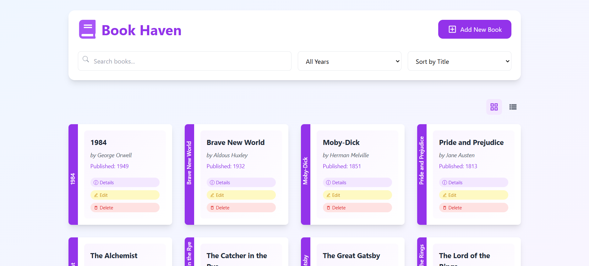

# 📚 MERN Bookstore Project 🌟

A full-stack bookstore application built using the **MERN stack** (MongoDB, Express.js, React, Node.js). 📖💻

## 📷 Demo



## 🚀 Features

- ✅ User authentication (Sign Up, Login)
- 📚 Browse books by category
- 🛒 Add books to the shopping cart
- 💳 Checkout and place orders
- ⚙️ Admin panel for managing books and orders

## 🛠️ Technologies Used

- **MongoDB**: NoSQL database for storing book details, user information, and orders. 🗃️
- **Express.js**: Backend framework for handling API requests. 🚚
- **React**: Frontend library for building a dynamic user interface. 🎨
- **Node.js**: JavaScript runtime for the server-side logic. 🖥️

## 📥 Installation

1. Clone the repository:

   ```bash
   git clone https://github.com/charithabimsara/Bookstore-MERN.git
   ```
2. Navigate to the project directory:

    ```
    cd Bookstore-MERN
    ```
3. Install backend dependencies:
    ```
    cd backend
    npm install
    ```

4. Install frontend dependencies:
    ```
    npm install
    ```
## ▶️ Running the Application

1. Start the backend server:
    ```
    cd backend
    npm start
    ```
2. Start the frontend server:
    ```
    npm run dev
    ```

3. The app will be available at http://localhost:5173 for the frontend and http://localhost:3000 for the backend.

## 📄 License

This project is licensed under the MIT License - see the LICENSE file for details. 🔓
